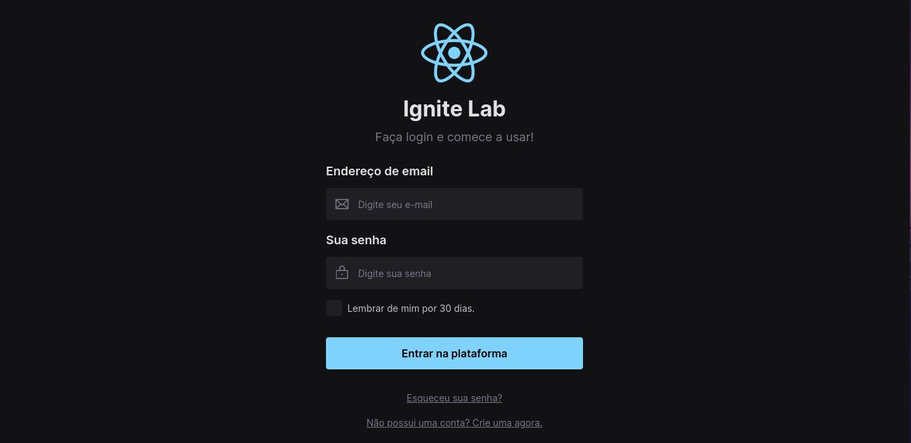
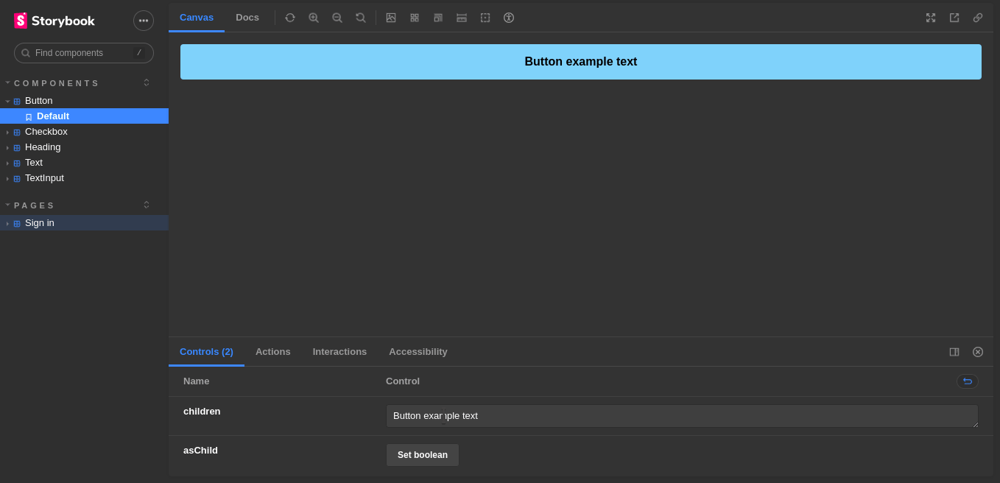

<h1 align="center">Design system with Storybook</h1>


<h1 align="center" widht="50%">
  
  
  
  
</h1>

### Sign in page created with components
 

### Design system with all the components 
 


## ⚡️ The Project
This project is design system created with ReactJs, Tailwind CSS and Storybook, based on the online event RocketSeat IgniteLab 3.
  
## 🎯 Features
 - Documentation with Storybook
 - UI testing with Storybook
  
## 🖥️ Used Tecnologies
 - [ReactJs](https://reactjs.org/)
 - [Storybook](https://storybook.js.org/)
 - [TailwindCSS](https://tailwindcss.com/)
## ⚙️ Dependencies
 - [Yarn](https://yarnpkg.com/)
 
## 🚀️ Getting Started

1. Clone this repository: 

```bash
git clone https://github.com/avnerjose/reactjs-lab-design-system.git && cd reactjs-lab-design-system
```
2. Go to the folder you cloned the repository and install all dependencies

```bash
yarn
```
3. Start the app
```bash
yarn dev
```
5. Go to the file localhost:3000 to see the app working

## 📕 Storybook 

### Deployed design system 

- [GitHub Pages](https://avnerjose.github.io/reactjs-lab-design-system/)
### Run design system
```bash
yarn storybook
``` 

### Run tests

```bash
yarn test-storybook
```
